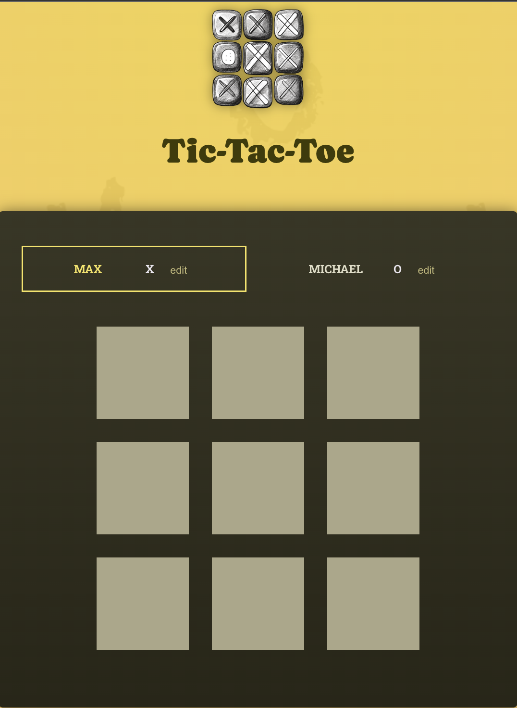
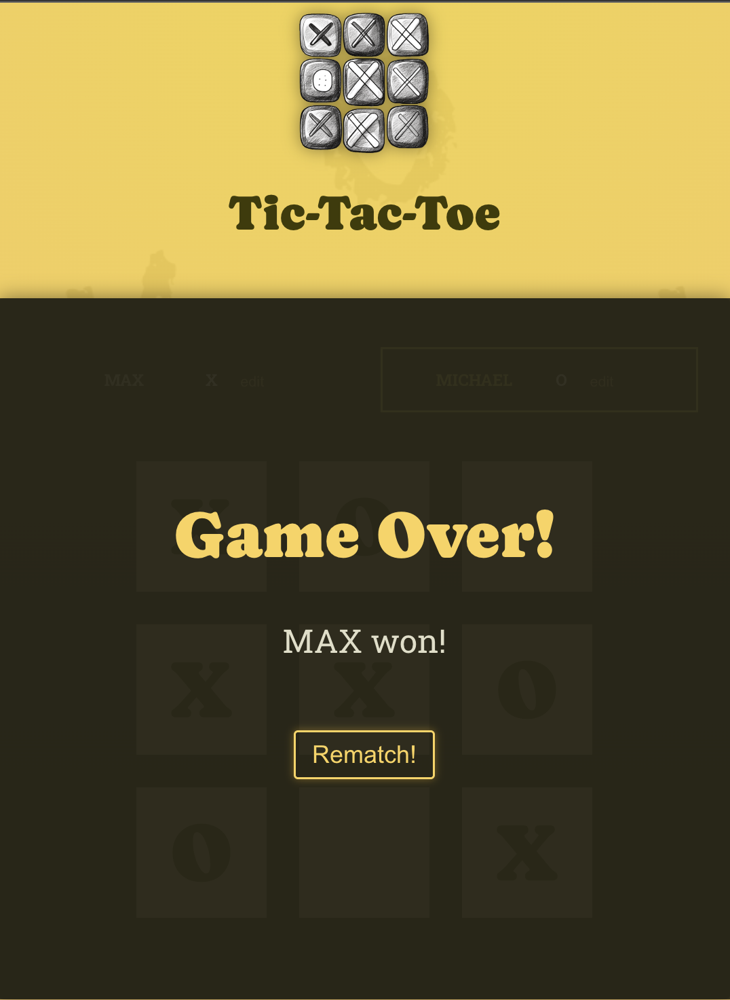

# 🎮 React Tic-Tac-Toe

An interactive **Tic-Tac-Toe game** built with React and Vite.  
Players can edit their names, take turns, and view the game history in the log.  
The game also detects wins and draws, and lets you start a rematch instantly.

---

## ✨ Features

- 📝 Editable player names
- 🎲 Real-time gameplay with turn switching
- 🏆 Winner and draw detection
- 📜 Move history log
- 🔁 Restart / Rematch functionality

---

## 📸 Screenshots

  


_(Place your screenshots inside the `public/` folder and name them `screenshot1.png` and `screenshot2.png`.)_

---

## 🚀 Getting Started

### 1. Clone the repository

```bash
git clone https://github.com/cesardeltoral/07-tic-tac-toe-starting-project.git
cd 07-tic-tac-toe-starting-project

2. Install dependencies
npm install

3. Run the app
npm run dev


Open your browser at http://localhost:5173
 (default Vite server).

📂 Project Structure
07-tic-tac-toe-starting-project/
│── public/
│   ├── bg-pattern-dark.png
│   ├── bg-pattern.png
│   ├── game-logo.png
│   ├── screenshot1.png
│   └── screenshot2.png
│
│── src/
│   ├── assets/
│   │   └── react.svg
│   ├── components/
│   │   ├── GameBoard.jsx
│   │   ├── GameOver.jsx
│   │   ├── Log.jsx
│   │   └── Player.jsx
│   ├── App.jsx
│   ├── index.css
│   ├── index.jsx
│   └── winning-combinations.js
│
│── README.md
│── package.json
│── vite.config.js
│── index.html
│── .gitignore


🤝 Contributing

Contributions are welcome! Please fork this repository and open a pull request with your changes.

📜 License

This project is licensed under the MIT License.
```
